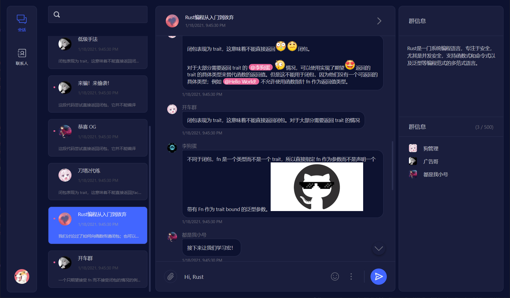

# White Raven  

White Raven 是一个由 [React](https://reactjs.org/) 实现的即时通讯（IM）应用，其名取自[《冰与火之歌》](https://awoiaf.westeros.org/index.php/White_raven)。

目前，后端仍处于开发中，本项目运行后将使用 Mock Data 提供预览效果。

## （~~画饼~~）路线

- [ ] 文档
  - [x] 提供初步可用的[即时通讯 API 文档](./docs/api-document.md)，用户可以根据该 API 自行提供后端程序，包括适配一些现有的即时通讯平台。
- [ ] UI/组件：秉着练手的原则，项目目前的 UI 组件全部自行编写，尽量不引入第三方组件库。
  - [x] 虚拟化列表；
  - [x] 无限滚动 + 虚拟化消息列表；
  - [x] 懒加载 Switch 导航组件；
  - [x] 模态 Dialog 组件；
  - [x] 文本高亮组件；
  - [x] 私聊、群聊相关界面；
  - [ ] 富文本输入框；
  - [ ] 设置窗口（已完成国际化、主题切换的支持，但 UI 上未提供良好的入口点）；
  - [ ] 表情包管理，图片、文件的发送与接受；
- [ ] 提供独立的后端支持
  - [ ] 实现注册、登录等鉴权接口；
  - [ ] 实现私聊、群聊通讯；
  - [ ] 实现表情包上传、下载与发送；
  - [ ] 实现文件传输；
  - [ ] 实现语音、视频发送；
  - [ ] 实现语音、视频通话；

## 截图




## 运行

```cmd
> yarn start
```

## 贡献

项目目前处于起步阶段，欢迎各位前端大佬参与到开发中来，你可以：

- 通过 [Issue](https://github.com/DingpingZhang/white-raven/issues) 反馈 Bug，提出建议或需求；
- Fork 此项目，并通过 [Pull Requests](https://github.com/DingpingZhang/white-raven/pulls) 共享你的代码。

## 鸣谢

- UI 设计来源：[Dribbble](https://dribbble.com/shots/14723765-Inbox-Light-Dark)
