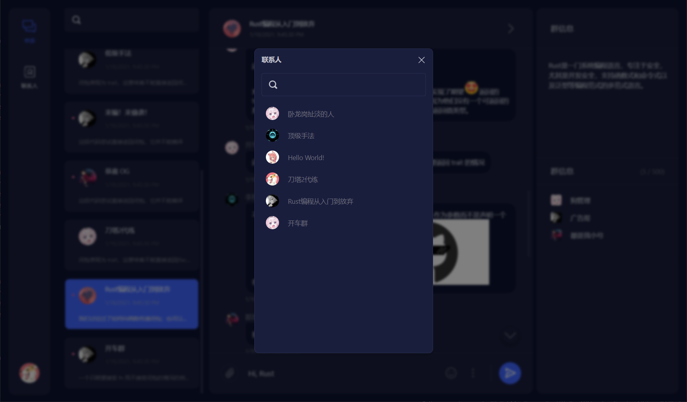

# White Raven   [](./LICENSE)

White Raven 是一个由 [React](https://reactjs.org/) 实现的即时通讯（IM）应用，其名来自[《冰与火之歌》](https://awoiaf.westeros.org/index.php/White_raven)，取其信使之意。

本项目主要有两个分支：

- `master`：目前为预览分支，由于后端仍在开发中，`master` 分支运行后将展示 Mock Data 用于预览。
- `dev`：开发分支，主要更新都在该分支上进行，如果你自己适配了 API，或是找到了可用的后端，可以 checkout 到该分支下运行本项目。

## （~~画饼~~）TODO

以下部分功能未合入 `master` 分支，仅在 `dev` 分支可用。

- [ ] 文档
  - [x] 提供初步可用的[即时通讯 API 文档](./docs/api-document.md)，用户可以根据该 API 自行提供后端程序，包括适配一些现有的即时通讯平台。
- [ ] UI/组件：秉着练手的原则，项目目前的 UI 组件全部自行编写，尽量不引入第三方组件库。
  - [x] 虚拟化列表；
  - [x] 无限滚动 + 虚拟化消息列表；
  - [x] 懒加载 Switch 导航组件；
  - [x] 模态 Dialog 组件；
  - [x] 文本高亮组件；
  - [x] 私聊、群聊相关界面；
  - [ ] 富文本输入框；
  - [x] 设置窗口（已完成国际化、主题切换的支持，但 UI 上未提供良好的入口点）；
  - [x] 表情包管理;
  - [x] 图片发送与接收；
  - [ ] 任意文件的发送与接收。
- [ ] 提供独立的后端支持
  - [x] 实现注册、登录等鉴权接口；
  - [x] 实现私聊、群聊通讯；
  - [ ] 实现表情包上传;
  - [x] 实现表情包下载与发送；
  - [x] 实现文件传输；
  - [ ] 实现语音、视频发送；
  - [ ] 实现语音、视频通话。

## 截图





## 运行

```cmd
// 首次运行，restore node_modules
> yarn

// 以 debug 模式运行项目
> yarn start

// 编译项目，编译完成后，进入生成的 ./build 目录下，打开 index.html 文件运行
> yarn build
```

## 贡献

项目目前处于起步阶段，欢迎各位前端大佬参与到开发中来，你可以：

- 通过 [Issue](https://github.com/DingpingZhang/white-raven/issues) 反馈 Bug，提出建议或需求；
- Fork 此项目，并通过 [Pull Requests](https://github.com/DingpingZhang/white-raven/pulls) 贡献你的代码。（请向 `dev` 分支发起 PR）

## 鸣谢

- UI 设计来源：[Dribbble](https://dribbble.com/shots/14723765-Inbox-Light-Dark)
